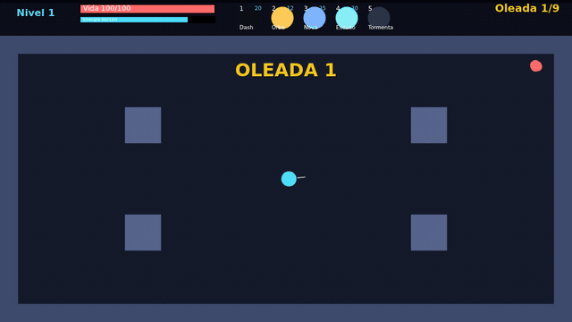
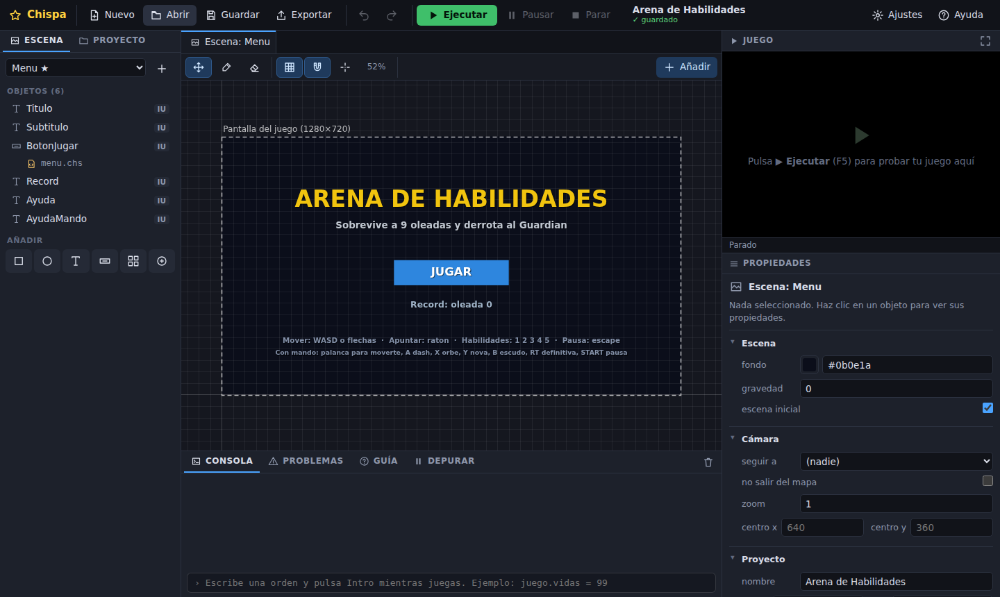
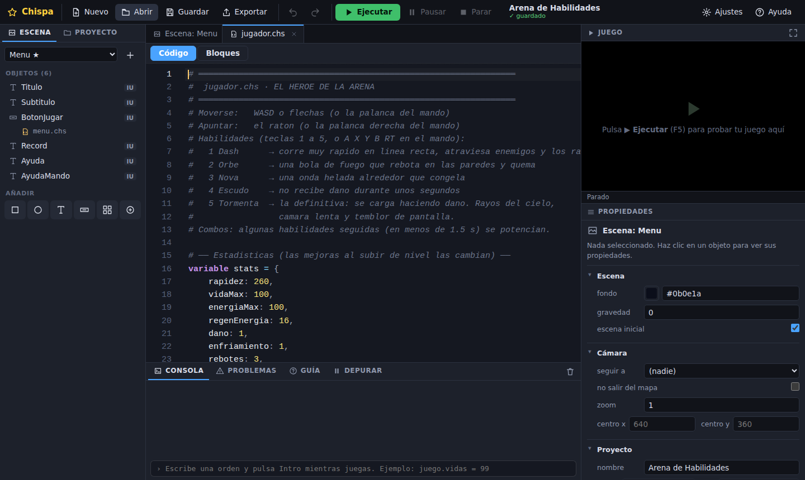
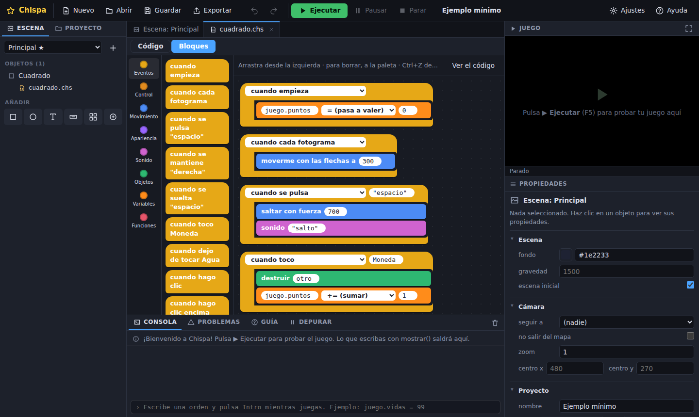

<div align="center">

# ✨ Chispa

**Haz tus propios videojuegos 2D programando en español.**

<a href="https://chispa-motor.github.io/chispa/"></a>

**Sin instalar nada:** se abre en el navegador.

Un editor en el navegador y un lenguaje de programación pensado para quien
empieza (a partir de unos 12 años): se escribe como se habla, y cuando algo
sale mal te explica qué pasa y cómo arreglarlo.

[](LICENSE)




*La «Arena de Habilidades», un juego completo hecho solo con Chispa (está en `proyectos/`).*

</div>

---

## Así se programa en Chispa

```
cuando empieza:
    juego.puntos = 0

cuando cada fotograma:
    yo.moverConFlechas(300)

cuando se pulsa "espacio":
    yo.saltar(700)
    sonido.efecto("salto")

cuando toco Moneda:
    destruir(otro)
    juego.puntos += 1
```

Sin llaves, sin punto y coma, sin inglés. Las tildes son opcionales:
`funcion` y `función` valen igual. Y si te equivocas:

```
Línea 2: has escrito 'yo.moverconflecha', que se parece mucho a 'moverConFlechas', una propiedad del motor.
   ¿Querías decir 'moverConFlechas'?
```

## Cómo se ve

| El editor | Código… | …o bloques |
|---|---|---|
|  |  |  |

## Empezar

**Abre [chispa-motor.github.io/chispa](https://chispa-motor.github.io/chispa/) y ya está.** No hay que
instalar nada ni crear ninguna cuenta. La primera vez te pregunta «¿Hacemos tu
primer juego?» y te guía paso a paso.

Tus proyectos se guardan solos **en tu navegador** (en ese ordenador). Para
llevártelos a otro sitio o guardar una copia, usa el botón **Guardar**:
descarga un archivo `.chispa.json` que luego abres con **Abrir**.

**¿Es tu primera vez? Lee [EMPIEZA_AQUI.md](EMPIEZA_AQUI.md).** En 10 minutos
tienes un personaje que anda, salta y recoge monedas. Después, para aprender
de verdad, sigue el curso **[Aprende Chispa](APRENDE_CHISPA.md)** (5 niveles,
con ejercicios y mini proyectos) y ten a mano la **[chuleta](CHULETA_CHISPA.md)**.

**¿Qué hay de nuevo en la 1.1?** Plantillas de juegos, dibujos, sonidos y
música listos, controles de interfaz, pantallas listas, varios jugadores,
luces, efectos y exportar a itch.io en un clic: **[NOVEDADES_1.1.md](NOVEDADES_1.1.md)**.

### Si quieres modificar el propio Chispa

Para cambiar el motor o el editor (no hace falta para hacer juegos),
necesitas [Node.js](https://nodejs.org) 22 o más nuevo (la «LTS» de su web
vale) y Git:

```
git clone https://github.com/chispa-motor/chispa.git
cd chispa
npm install
npm run dev
```

Se abre el editor en http://localhost:5173 y cada cambio que hagas en el
código se ve al momento.

> **En Windows**, si PowerShell dice que «la ejecución de scripts está
> deshabilitada», escribe `npm.cmd install` y `npm.cmd run dev`.

Cada vez que se sube un cambio a la rama `main`, GitHub pasa todos los tests
y, si todo va bien, publica la web nueva él solo
([`.github/workflows/publicar.yml`](.github/workflows/publicar.yml)).

## Qué trae

**El editor**
- Escena visual: arrastrar, cambiar el tamaño, seleccionar varios, copiar y
  pegar, deshacer para todo.
- Mapas de casillas para pintar suelos y paredes.
- Plantillas (como los *prefabs*) y copias enlazadas.
- Editor de *pixel art* con animaciones.
- Tutorial guiado y una guía con recetas («¿cómo hago…?») dentro del
  editor.
- Tema claro u oscuro, tamaño de letra y atajos de teclado (F1).
- Se guarda solo en el navegador y lo recupera si se cierra de golpe.

**El lenguaje**
- En español y sin tildes obligatorias.
- **Errores que enseñan**: dicen la línea, qué pasa y cómo arreglarlo, y se
  subrayan mientras escribes.
- **Modo bloques**, como Scratch: el mismo script se ve como código o como
  bloques, y puedes cambiar cuando quieras.
- **Depurador**: puntos de parada, paso a paso y el valor de cada variable.
- Órdenes en la consola mientras juegas (`juego.vidas = 99`).

**El motor 2D**
- Física, choques, plataformas que se mueven y plataformas que se
  atraviesan desde abajo.
- Cámara que sigue al jugador.
- Enemigos que te persiguen o huyen **rodeando las paredes**, sin código.
- Rayos, diálogos con opciones, mensajes entre objetos y datos del juego.
- Partículas, animaciones, fundidos y dibujo directo en la pantalla.
- Sonidos que se generan solos (`sonido.efecto("explosion")`) y música.
- Teclado, ratón, **mando** y botones táctiles automáticos en el móvil.
- Guardar récords y partidas.

**Compartir tus juegos**
- **Exportar** el juego como **una sola página web** que funciona sin
  internet: se abre con doble clic.
- Pasos guiados para subirlo a **itch.io** o a **GitHub Pages**.
- No hace falta ninguna cuenta ni ningún servidor.

**Seguro para compartir**
- Abrir el proyecto de otra persona nunca puede ejecutar código fuera de
  Chispa, leer tus otros proyectos ni conectarse a internet (ver
  [AUDITORIA_SEGURIDAD.md](AUDITORIA_SEGURIDAD.md)).

## ¿De quién son mis juegos?

**Tuyos.** La licencia de Chispa (MPL 2.0) es para el *motor*, no para lo que
haces con él. Puedes vender tus juegos, regalarlos o guardarlos para ti, sin
enseñar su código si no quieres. Más detalles en
[EMPIEZA_AQUI.md](EMPIEZA_AQUI.md#de-quién-son-mis-juegos).

## Documentación

| Archivo | Qué hay |
|---|---|
| [EMPIEZA_AQUI.md](EMPIEZA_AQUI.md) | Tu primer juego, paso a paso |
| [APRENDE_CHISPA.md](APRENDE_CHISPA.md) | Curso desde cero por niveles: cada comando con un ejemplo y su error típico, ejercicios y mini proyectos |
| [CHULETA_CHISPA.md](CHULETA_CHISPA.md) | Hoja resumen: todos los comandos, una línea cada uno |
| [MANUAL_CHISPA.md](MANUAL_CHISPA.md) | Todo el lenguaje y los comandos, con un ejemplo de cada cosa, y las recetas |
| [ESPECIFICACION_CHISPA.md](ESPECIFICACION_CHISPA.md) | Las reglas del lenguaje |
| [DECISIONES.md](DECISIONES.md) | Por qué Chispa es como es |
| [AUDITORIA_SEGURIDAD.md](AUDITORIA_SEGURIDAD.md) | Qué se revisó y se arregló para que sea seguro |
| [LICENCIAS_DEPENDENCIAS.md](LICENCIAS_DEPENDENCIAS.md) | Lo que usa Chispa de otras personas, y sus licencias |

## Colaborar

¡Toda ayuda es bienvenida! Arreglar un error, mejorar un mensaje, traducir una
receta, probarlo con tu clase… Mira [CONTRIBUIR.md](CONTRIBUIR.md) y las
[normas de la comunidad](NORMAS_COMUNIDAD.md).

¿Has encontrado un fallo de **seguridad**? No lo publiques: sigue
[SEGURIDAD.md](SEGURIDAD.md).

Para quien programa en Chispa:

```
npm run pruebas             tests automáticos (lenguaje, motor, editor, seguridad...)
npm run pruebas:navegador   el editor en un Chromium de verdad, usado como una persona
npm run build               compila el editor en dist/ (con su política de seguridad)
npm run manual              regenera MANUAL_CHISPA.md, APRENDE_CHISPA.md y CHULETA_CHISPA.md
npm run licencias           revisa las licencias de las dependencias
npm run cabeceras           pone la cabecera de la licencia a los archivos nuevos
npm run capturas            hace las capturas y el GIF de este README
```

```
src/
├── motor/        Núcleo: bucle, dibujo, entrada, sonido, errores
├── objetos/      Objetos, escena, cámara, física, caminos, partículas, componentes
├── chispa/       El lenguaje: léxico → sintaxis → análisis → ejecución (ver chispa/LEEME.md)
├── proyecto/     El formato del proyecto, su validación y el juego en marcha
├── editor/       El editor (estado, código, bloques, escena, paneles, tutorial)
├── exportar/     La página del juego exportado y la publicación
├── reproductor/  El motor sin el editor (lo que va dentro de un juego exportado)
├── ejemplos/     El ejemplo mínimo
└── configuracion.ts   Los enlaces que se pueden cambiar (donaciones, repositorio)
```

## Apoya Chispa

Chispa es gratis y lo seguirá siendo. Si te gusta y quieres ayudar a que siga
creciendo:

<!-- CAMBIA ESTO: pon tu enlace de donaciones aquí y en src/configuracion.ts -->
**💛 [Apoya Chispa](#apoya-chispa)** *(el enlace llegará pronto)*

## Licencia

El código de Chispa tiene licencia **[Mozilla Public License 2.0](LICENSE)**.
Si cambias un archivo de Chispa y lo repartes, tienes que compartir esos
cambios con la misma licencia. **Tus juegos no**: son tuyos. Los juegos de
ejemplo (`proyectos/` y `src/ejemplos/`) son de dominio público (CC0): úsalos
como quieras.

Creado por **Rodrigo**. Todas las personas que han ayudado están en
[CREDITOS.md](CREDITOS.md).
